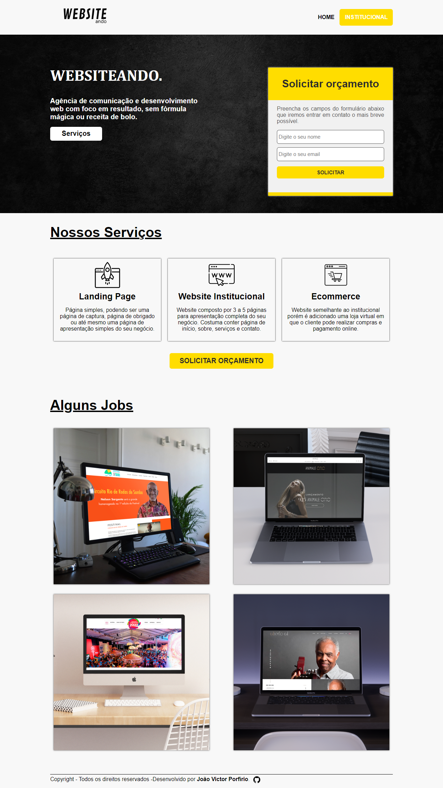
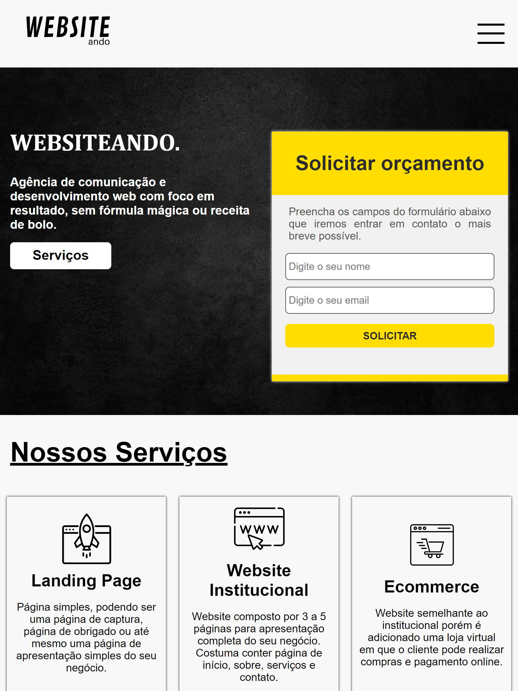

Readme

# LandingPage Portfólio

<!------------------------------------STACKS-->
#### Stacks:

 <a href="https://developer.mozilla.org/pt-BR/docs/Web/HTML"><a/>
   <a href="https://developer.mozilla.org/pt-BR/docs/Web/CSS"><a/>
     <a href="https://github.com/braziljs/eloquente-javascript"><a/>
   

  
  <!------------------------------------TOOLS-->
 #### Tools:
 <a href="https://code.visualstudio.com/"><a/>
  
  
  
   <!------------------------------------DESCRIPTION-->

#   Sobre o projeto <!---write here : talk a little about project: what's does, example.  -->
> Este projeto é uma LandingPage que possui o objetivo de apresentar um portfólio e captar possíveis clientes através do formulário de contato. Na versão atual nenhum botão ou interação funciona pois foi utilizado apenas HTML e CSS para desenvolvimento, com exceção do menu responsivo que foi utilizado JavaScript. O principal objetivo com a criação deste projeto foi aplicar os conhecimento teóricos aprendidos em cursos para melhor fixação.
  
  
  # Conhecimentos utilizados

-HTML usado para desenvolvimento da estrutura.
 
-CSS exercitado com flexbox, outros comandos para estilização e responsividade.
 
-JS para animação do menu responsivo.
